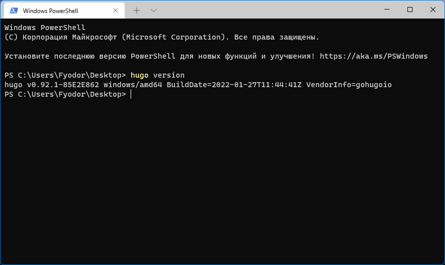

### Установка генератора статических сайтов Hugo

#### Linux

##### snap

```
snap install hugo
```

##### Debian и Ubuntu

```
sudo apt-get install hugo
```

#### Windows

Способ 1. Загрузка программы с [Hugo Releases](https://github.com/gohugoio/hugo/releases).

Способ 2 (установка с помоцью Chocolatey):

```
choco install hugo -confirm
```


